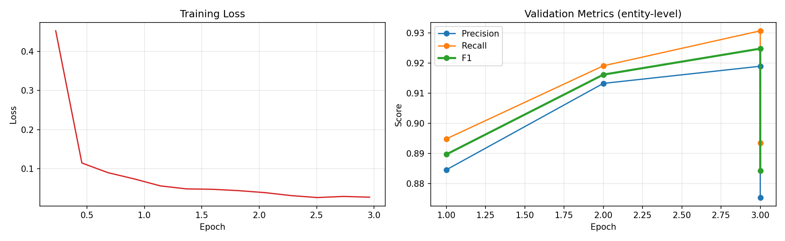
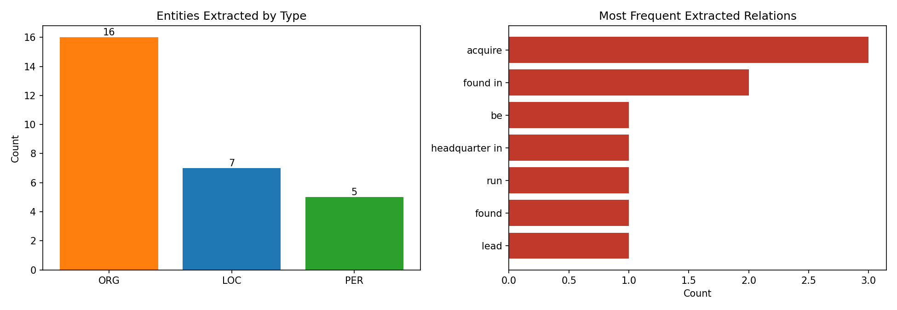
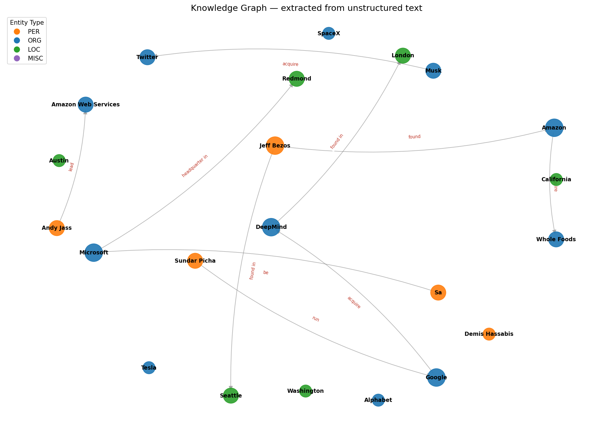

# NER + Relation Extraction → Knowledge Graph

An end-to-end information extraction pipeline that turns unstructured text
into a queryable knowledge graph. A fine-tuned transformer identifies
entities, dependency-parse rules extract relations between them, and the
resulting triples are assembled into a graph you can query, traverse, and
visualize.

```
Raw text
   ↓  [DistilBERT token classification, fine-tuned on CoNLL-2003]
Entities  (PER / ORG / LOC / MISC)
   ↓  [spaCy dependency-parse SVO extraction]
Triples   (subject, relation, object)
   ↓  [NetworkX graph construction]
Knowledge Graph  — queryable, traversable, visualizable
```

## Motivation

NER on its own gives you a list of names. That's not knowledge — it's a word
list. The interesting problem is the second half: recovering how those
entities *relate* to each other, and assembling those relations into a
structure you can actually query. This project builds both halves and joins
them.

## Part 1 — Named Entity Recognition

**Task:** token classification on CoNLL-2003 (the standard NER benchmark) —
`PER`, `ORG`, `LOC`, `MISC` in BIO tagging format.

**Model:** `distilbert-base-cased` with a token-classification head, fine-tuned
for 3 epochs.

### The core technical challenge: subword label alignment

The dataset labels **words**, but the tokenizer produces **subwords**:

```
Words:     ["Elon",  "Musk",  "founded", "SpaceX"]
Labels:    [ B-PER,   I-PER,    O,         B-ORG ]

Subwords:  ["elon", "mu", "##sk", "founded", "space", "##x"]
Aligned:   [ B-PER,  I-PER, -100,   O,        B-ORG,  -100 ]
```

Continuation subwords are marked `-100` (PyTorch's `ignore_index`) so they
contribute nothing to the loss. Getting this wrong silently corrupts training
— it's the single most common bug in token classification.

**Why a *cased* model:** "Apple" (company) vs "apple" (fruit). Lowercasing
destroys one of the strongest signals available for entity recognition.

**Why seqeval instead of accuracy:** roughly 85% of tokens are `O`. A model
that predicts `O` for everything scores ~85% token accuracy while being
useless. `seqeval` measures entity-level precision/recall/F1 — a prediction
only counts if the **full span and the type** both match.

## Part 2 — Relation Extraction

NER gives graph **nodes**. Edges require relation extraction.

Approach: dependency-parse-based Subject-Verb-Object extraction via spaCy.

```
        founded  (ROOT, verb → the relation)
        /      \
   nsubj        dobj
   Musk         SpaceX
```

The extractor walks each verb's children for `nsubj` / `dobj` / `pobj`,
expands each to its full noun phrase, and keeps the triple **only if both
subject and object map onto entities the NER model found**. That filter is
what keeps the graph clean.

**Rule-based, deliberately:** trained relation extractors need labeled relation
data, which is rare and expensive. Dependency rules produce a working graph
immediately and are fully interpretable — you can always trace *why* a triple
was extracted. The trade-off is recall: unusual phrasings get missed.

## Part 3 — Knowledge Graph

Triples are assembled into a NetworkX `MultiDiGraph` — directed, typed nodes,
labeled edges. Once it's a graph, graph algorithms come for free:

| Query | Method |
|---|---|
| What do we know about X? | in-edges + out-edges of node X |
| Who are the hubs? | degree centrality |
| How is A connected to B? | shortest path |
| All organizations mentioned | filter nodes by `entity_type` |

Exports: interactive HTML (pyvis), static PNG (matplotlib), JSON triples, and
GraphML (loadable into Neo4j or Gephi).

## Results

| Metric | Score |
|---|---|
| NER test precision | 87.5% |
| NER test recall | 89.4% |
| NER test F1 | **88.4%** |
| Model parameters | 65,197,833 (~65.2M) |
| Graph nodes | 22 |
| Graph edges | 10 |
| Entities extracted (sample doc) | 28 |
| Relations extracted (sample doc) | 10 |

## Key Takeaways

- The fine-tuned NER model reached **88.4% entity-level F1** on CoNLL-2003
  test — a solid result given seqeval's strict full-span-and-type matching
  criterion (this is a meaningfully harder bar than token accuracy).
- Precision (87.5%) and recall (89.4%) are close together, meaning the model
  isn't systematically over- or under-predicting entities — errors are
  fairly balanced between missed entities and false positives.
- From a 5-sentence sample document, the pipeline surfaced **28 entities**
  and distilled them down to **10 clean subject-relation-object triples**
  forming a **22-node graph**. The entity-to-relation drop-off (28 → 10) is
  expected and reflects the deliberate precision-over-recall design of the
  rule-based extractor: only triples where both sides matched a real NER
  entity were kept, which is what keeps the graph clean rather than noisy.
- The gap between entities found and relations extracted is the clearest
  signal of where a supervised relation classifier (see "What's Next")
  would add the most value — recovering the relations that dependency
  rules miss due to passive voice, appositives, or cross-sentence
  coreference.

## Visualizations

**NER training curves** — loss and entity-level validation metrics:



**Per-entity-type performance** — which entity types are hardest:


**BIO tag confusion matrix** — where tag predictions get mixed up:


**Extraction distribution** — what the pipeline pulled out of the document:



**The knowledge graph itself:**



An interactive version is in `knowledge_graph.html` — open it in a browser to
drag nodes and inspect relations.

## Project Structure

```
p3_step1_ner_data.py             # Data loading + subword label alignment
p3_step2_train_ner.py            # Fine-tune DistilBERT, evaluate with seqeval
p3_step3_inference.py            # Entity extraction from raw text
p3_step4_relation_extraction.py  # Dependency-parse SVO triple extraction
p3_step5_knowledge_graph.py      # Graph construction, querying, visualization
p3_step6_charts.py               # All evaluation charts

knowledge_graph.html             # Interactive graph